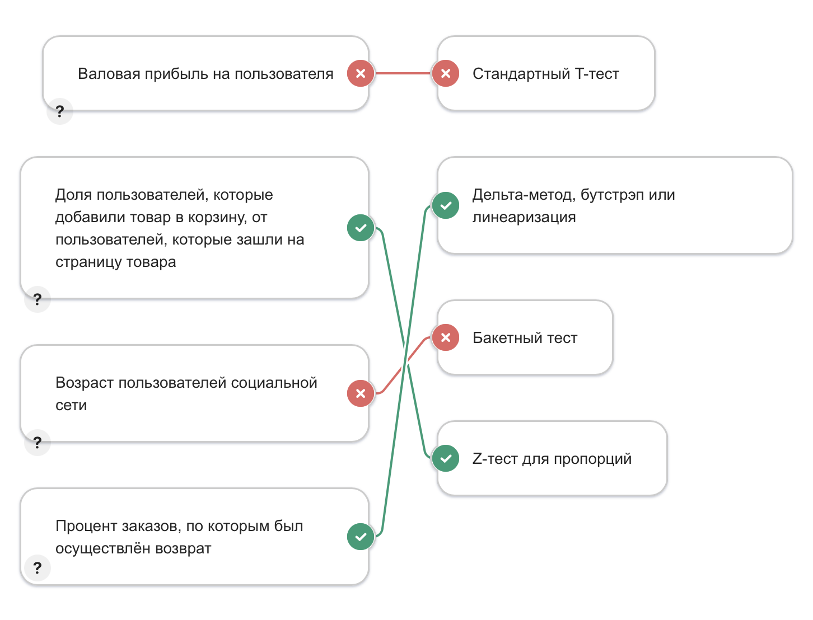
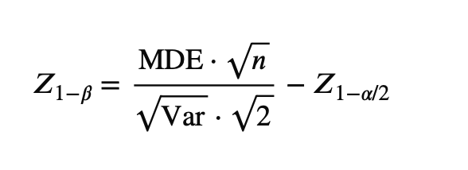
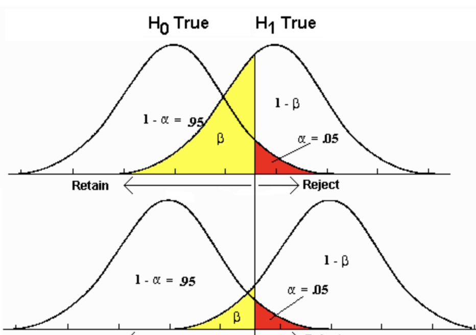
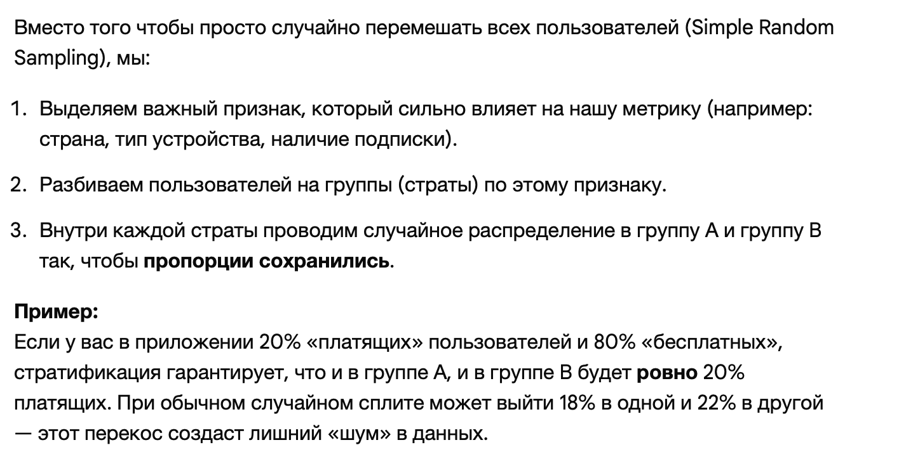
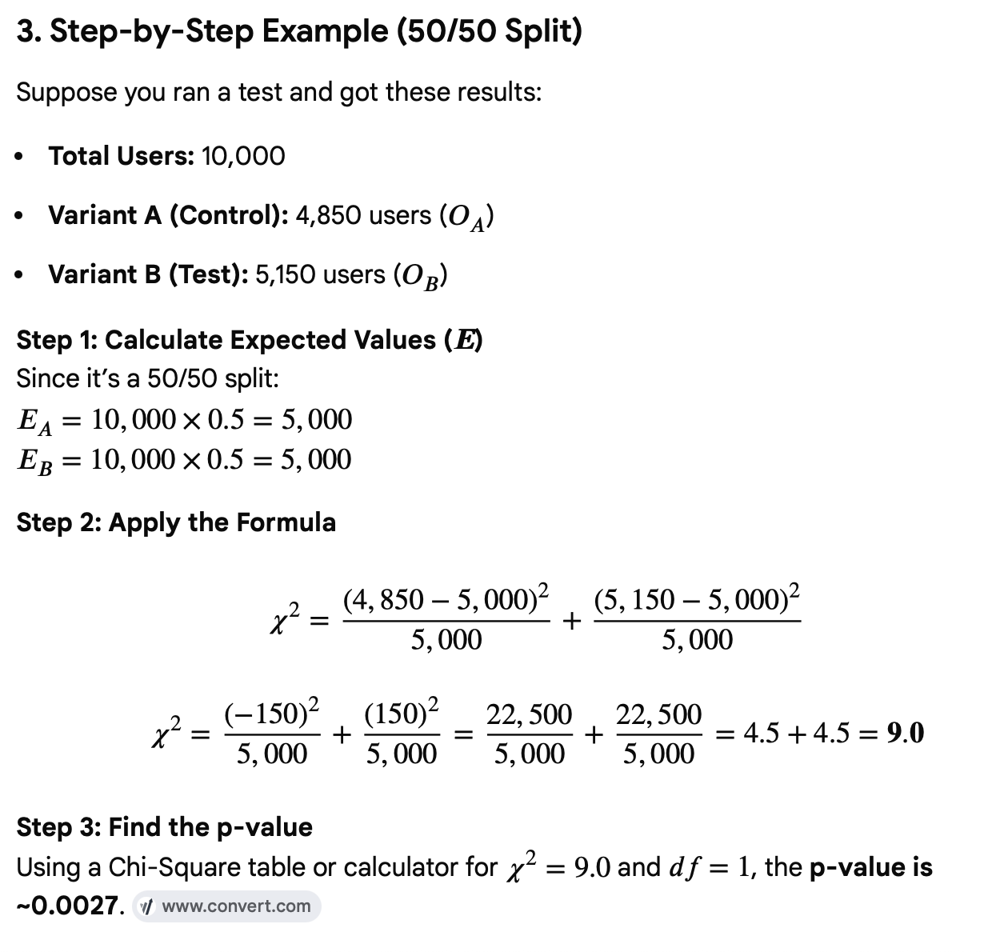

# Планирование и Проведение A/B эксперимента

## Часть 1: Планирование

**Цель проверки статистических гипотез** — на основе небольшой выборки
сделать обоснованные предположения о генеральной совокупности.

**Нулевая гипотеза H0** - это исходное предположение о данных.  

**Альтернативная гипотеза H1** - противоположность  

**Критические значения** формируют область допустимых значений для
статистики, при условии, что нулевая гипотеза верна.

**Ошибка первого рода, α, FPR** — это ситуация, когда исследователь отвергает
нулевую гипотезу, хотя она на самом деле верна.

**Ошибка второго рода, β, FNR** — это ситуация, когда исследователь не отвергает
нулевую гипотезу, хотя верна альтернативная.

**Мощность статистического теста, 1 − β** — это вероятность принять альтернативу, когда верна альтернатива

**pvalue** - вероятность получить критическое значение статистики или еще более критическое

### Шаг 0

Выбираем метрики

Можно конечно измерять напрямую выручку, но у нее очень большая дисперсия => потребруеся много наблюдений.

- Непрерывные: 
выручка / прибыль, количество заказов, время загрузки страницы    
DAU (Daily Active Users)    
WAU / MAU - Weekly, Monthly     
Retention - how many users returned after N days 
Churn Rate  
LTV         
CAC     

MAPE - Mean Absolute Percentage Error

ARPU - Average Revenue per User     
ARPPU - Average Revenue per Paying User     
AOV - Average Order Value       

- Бинарные (конверсионные) метрики  
CR - Conversion Rate   

Плюс если единица рандомизации (пользователь) не совпадает с единицей анализа (например заказ), то применять z-тест или t-тест не получится, так как не соблюдается независимость величин. Это называется Ratio-метрика

Выбираем гипотезы H0, H1

Смысл использование z-теста для пропорций (а не t-теста) в том, что при пропорциях случайные величины имеются Ber распределение. То есть, зная предполагая ожидание E = p, мы автоматически знаем дисперсию D = p * (1 - p)

А вот для измерения возраста, например, мы в приницпе не знаем реальное распределние, поэтому используем распределение Стьюдента

### Шаг 1: Фиксируем α

### Шаг 2: Определяем MDE из здравого смысла

**Пример:** Текущая конверсия P_c = 10%, хотим обнаружить прирост на 1%, тогда P_t = 11% и MDE = 0.01

Power ↑ => n ↑, MDE ↑   
MDE ↑ => Power ↑, n ↓   
n ↑ => Power ↑, MDE ↓   

### Шаг 3: Фиксируем β (выбираем мощность теста)

**β** — вероятность ошибки второго рода (не обнаружить существующий эффект)

β = 0.2 → мощность 80% (z_β = 0.84)

### Шаг 4: Находим оптимальное q

**q** = доля трафика в контрольной группе

$$q^* = \frac{\sqrt{P_c(1-P_c)}}{\sqrt{P_c(1-P_c)} + \sqrt{P_t(1-P_t)}}$$

**На практике:**
- Если MDE небольшой → q ≈ 0.5 (можно сразу брать)
- Если хотите точную оптимизацию → предварительный пилот с q = 0.5

### Шаг 5: Находим требуемый размер выборки n

$$
n = \frac{(z_{\alpha/2} + z_\beta)^2 \left[ \frac{P_c(1-P_c)}{q} + \frac{P_t(1-P_t)}{1-q} \right]}{(P_c - P_t)^2}
$$

$$n \approx \frac{2 \text{Var}_\text{hist} \cdot (\|z_{\alpha/2}\| + \|z_\beta\|)^2}{\text{MDE}^2}$$

Квантиль z_(1 - beta) прямо пропорциональна мощности

Var_hist - дисперсия на прошлых данных

z_beta - квантиль уровня beta для распреления со средним, которое равно MDE     
(beta это площадь под этим колоколом левее критического значения z_1-alpha/2)

Note: we always consider z_beta as for the centered distribution (meaning z_beta is the distance)

## Часть 2: Проведение эксперимента

### Шаг 1: Случайное распределение пользователей

**Принципы:**

- Каждый пользователь случайно назначается в контроль или тест один раз
- Распределение **стабильное и воспроизводимое** (один пользователь всегда видит один вариант)
- **Независимое** — назначение одного пользователя не влияет на других

При планировании эксперимента важно учесть потенциальное наличие
сетевого эффекта. Если группы влияют друг на друга, то вместо простой
рандомизации по пользователям необходимо использовать более сложные
способы.    

Плюс важно брать данные хотя бы за две недели (чтобы учитывать выходные)

**Пример:** n = 10000, q = 0.5
- N_control = 5000 пользователей видят A
- N_test = 5000 пользователей видят B

**Стратификация** 

### Шаг 2: Анализ результатов

Для каждой группы посчитаем:

$$\hat{P}_c = \frac{\text{conversions}_c}{N_c}$$

$$\hat{P}_t = \frac{\text{conversions}_t}{N_t}$$

$$\text{MDE}_{\text{observed}} = \hat{P}_t - \hat{P}_c$$

**Пример:**
- Контроль: 500 конверсий из 5000 → P̂_c = 0.10
- Тест: 550 конверсий из 5000 → P̂_t = 0.11
- Наблюдаемый эффект: 0.01 или +10%

### Шаг 3. Статистический тест (Z-тест для пропорций)

Примечание: используем не t-тест, так как верна ЦПТ, и считем, что распределение нормальное

Дополнительно можно делать бакетный тест (для количественных выборок, если число наблюдений большое). Это позволит уменьшит влияние выбросов. 

$H_0 = \{\hat{P}_t - \hat{P}_c = 0\}$

$H_1 = \{\hat{P}_t - \hat{P}_c \neq 0\}$

$$Z = \frac{\hat{P}_t - \hat{P}_c}{\sqrt{\frac{\hat{P}_c(1-\hat{P}_c)}{N_c} + \frac{\hat{P}_t(1-\hat{P}_t)}{N_t}}}$$

Где знаменатель — стандартная ошибка разницы.

Используем SE_unpooled (slightly more conservative)

### Шаг 4. P-value (двусторонний тест)

$$p\text{-value} = 2 \cdot P(Z > |Z_{\text{observed}}|)$$

**Правило принятия решения:**
- Если p-value < α (обычно 0.05) → **отклоняем H₀** → эффект статистически значим ✓
- Если p-value ≥ α → **не отклоняем H₀** → нет статистически значимого эффекта ✗

### Шаг 5. Доверительный интервал

Доверительный интервал (CI) — это диапазон значений, в котором с заданной вероятностью (обычно 95%) находится истинное значение оцениваемого параметра

Если ваш 95% доверительный интервал для разницы $(\hat{P_t} - \hat{P_c})$ не включает ноль, то результат статистически значим (p-value < 0.05).

$$\text{CI}_{95\%} = (\hat{P}_t - \hat{P}_c) \pm z_{\alpha/2} \cdot SE$$

**Интерпретация:**
- Если 0 входит в доверительный интервал → эффект не значим
- Если интервал полностью выше 0 → эффект положительный
- Если интервал полностью ниже 0 → эффект отрицательный

**Пример:**
- Эффект: +1%
- 95% CI: [0.5%, 1.5%]
- Вывод: Эффект между 0.5% и 1.5% с 95% уверенностью

### Шаг 6. Валидность 

Дополнительно провести проверки валидности эксперимента. Такими
проверками являются 
- A/A-тест. То есть берем две одинаковые группы и делаем тот же тест. Хотим принять H0.
- проверка на SRM (Simple Ration Mismatch). Например хотели выборку 50/50, проверяем это. Chi-square test

